# BeyondJA — Explore Beyond Jaghori

BeyondJA is a modern full-stack city exploration platform built with React.js and Django REST Framework.
The platform allows users to discover places, cities, local experiences, and community-driven content through a clean UI and a role-based dashboard system.

Designed with scalability, responsive design, and modern frontend architecture in mind.

![DRF]

## 🚀 Live Overview

🌐 Explore places, cities, and blogs

🔐 Role-based dashboard (Admin / Owner / User)

📊 Full CRUD operations

📱 Responsive & mobile-first design

⚡ Smooth UI interactions

🔎 Search & filtering system

🌙 Dark mode support

## ER DIAGRAM MODEL

  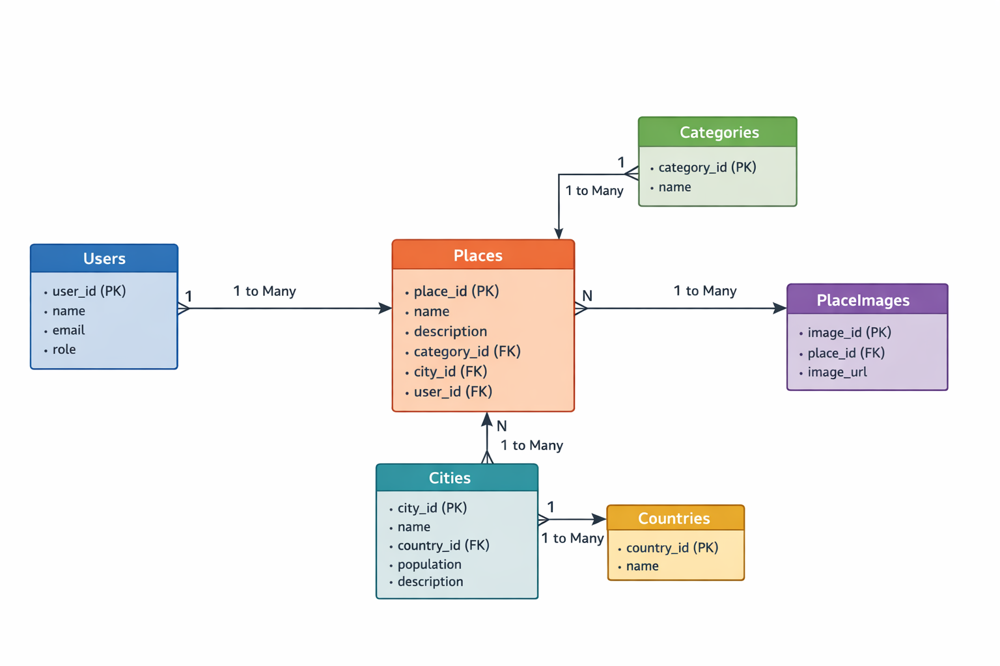

## Technologies Used

Frontend

- React.js
- Vite
- Tailwind CSS
- React Router DOM
- Framer Motion
- React Icons
- React Toastify
- Context API
- Custom Hooks
- Recharts

Backend

- Django
- Django REST Framework
- JWT Authentication
- SQLite / PostgreSQL
- Django Filters

# Pages & Features

## Public Pages

- Home

- Places
- Place Details

- Blog
- Blog Details

- About

- Contact

- Login

- Register

<!-- - Reset Password -->

- 404 – Not Found

## Dashboard (Role-Based Access)

- Dashboard Overview

- Users Management

- Places Management

- Cities Management

- Categories Management

- Countries Management

- Analytics Charts

- Settings

### 🔐 Access Control:

    Dashboard access is controlled using role-based authorization, simulated through JSON Server.

    Admin: Full access

    Business: Manage own places

    Viewer: Limited access - Explore content only

Authentication

The project uses:

- JWT Authentication
- Protected Routes
- Role-based authorization
- Persistent login state

### Project Folder Structure

    src/

    │
    ├── components/ # Reusable UI components
    ├── pages/ # Application pages
    ├── hooks/ # Custom React hooks (API & logic)
    ├── context/ # Global state (Auth, Theme)
    ├── routes/ # protected routes
    ├── assets/ # Images & icons
    ├── layouts/ # dashboard and main layout
    ├── api/ # API base configuration
    │
    ├── App.jsx
    └── main.jsx

## Project Timeline

- Start Date: October 2025

- End Date: 02,05, 2026

## Core Concepts & Techniques

- Context API (Authentication & Theme)

- Custom Hooks for API abstraction

- JSON Server as a mock REST API

- Component-based architecture

- Role-based authentication (simulated)

- Protected routes

- Search & filtering

- Responsive UI (mobile-first)

- CRUD operations (Create, Read, Update, Delete)

- Loading & error state handling

### Custom Hooks Example

The project heavily relies on custom hooks to keep components clean and reusable:

    > export const usePlaces = () => {
    > const { data = [], error, loading, refetch } = useFetch(`${ApiUrl}/places`);
    > return {
    >     places: data,
    >     hasPlace: data.length > 0,
    >     error,
    >     loading,
    >     refetch,
    > };
    > };

✔️ Centralized API logic
✔️ Clean UI components
✔️ Scalable architecture

## 🧩 Challenges Faced

- Simulating authentication without a real backend

- Role-based authorization

- Managing shared state across the dashboard

- Designing reusable, scalable components

- Handling async API states (loading, errors)

- Structuring a large React project cleanly

## 📚 Learning Outcomes

- Building real-world dashboards with React

- Working with APIs (DRF)

- Advanced state management using Context API

- Writing clean and reusable custom hooks

- Creating responsive UIs with Tailwind CSS

- Structuring scalable frontend applications

- Writing scalable and maintainable frontend code

## Install dependencies

    npm install

## Run JSON Server

    npm run jsonserver

## Start React app

    npm run dev

## Author

**Mohammad Juma Qasimi**  
**_Frontend Developer | React.js_**

> Building modern, scalable, and user-friendly web interfaces.

- Clean UI / UX
- Scalable frontend architecture
- Continuous learning mindset
  x

## Gallary

  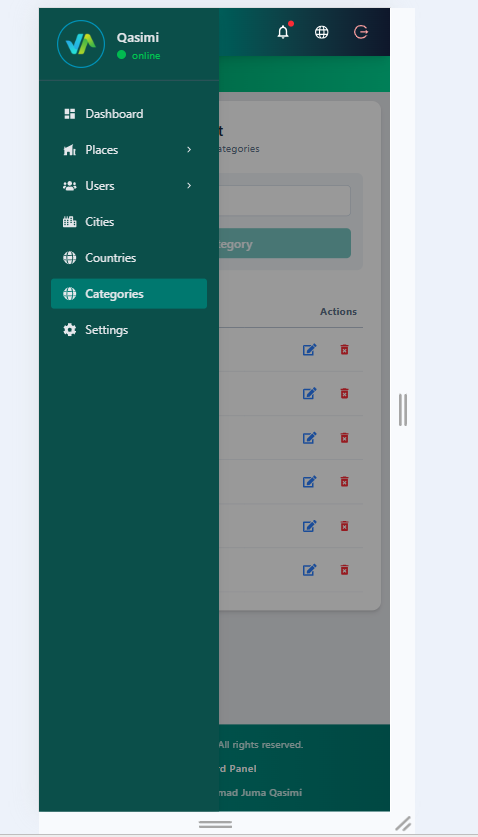
  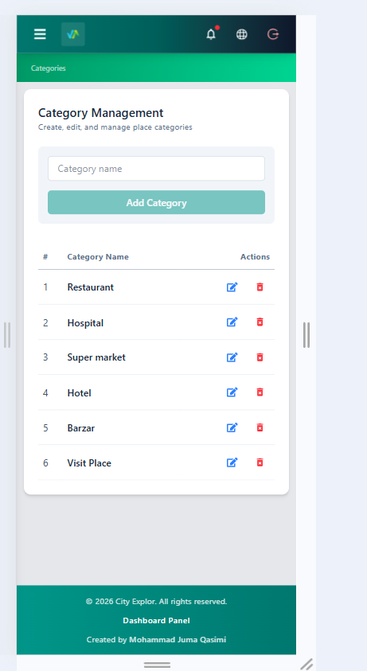

  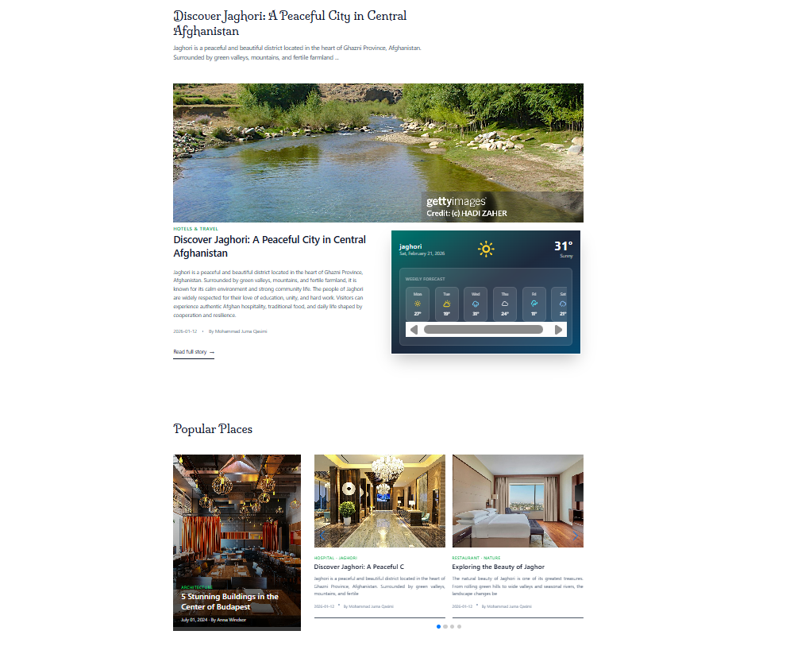
  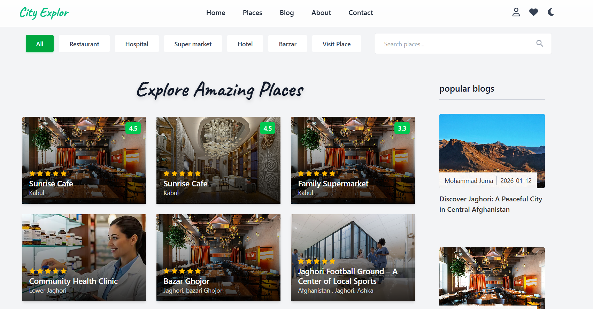

  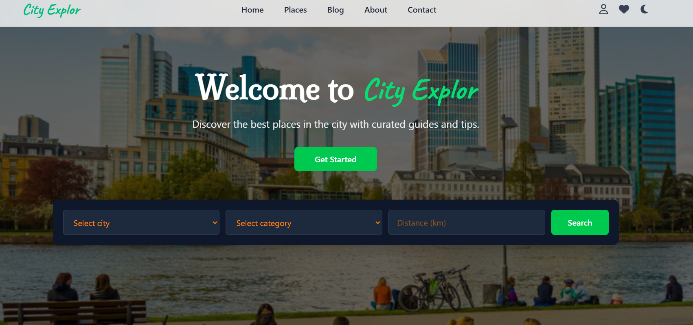
  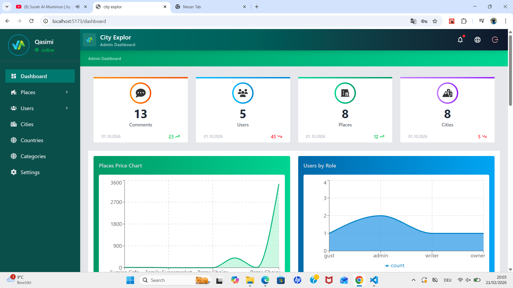

  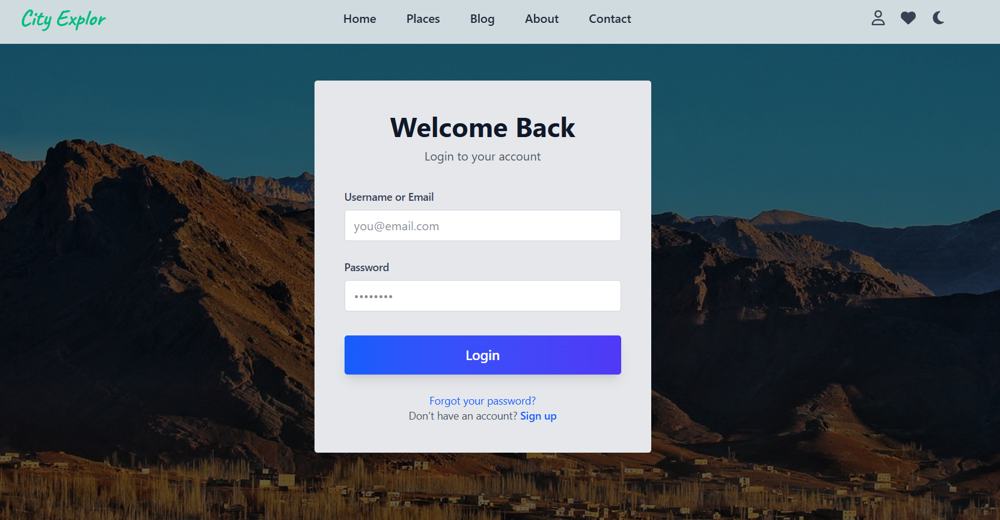
  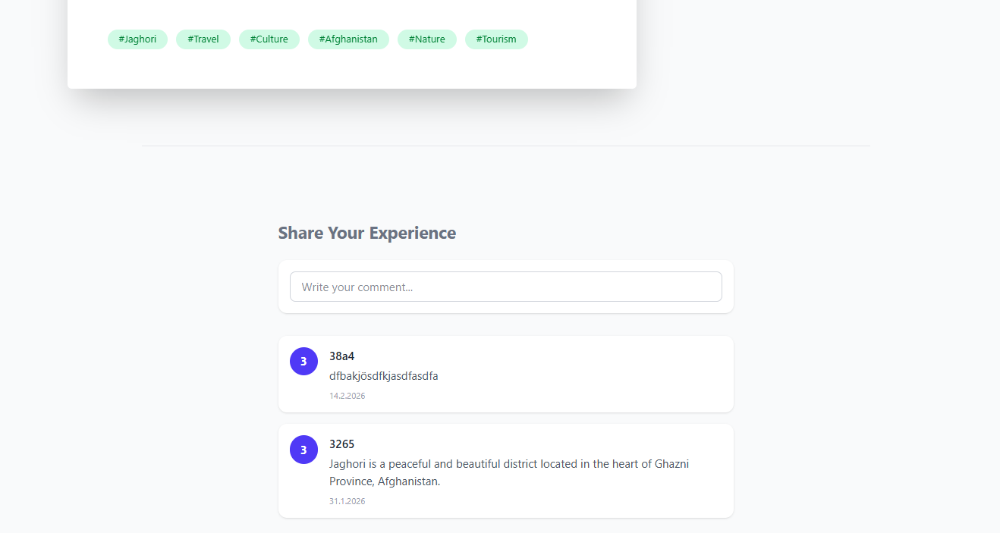

  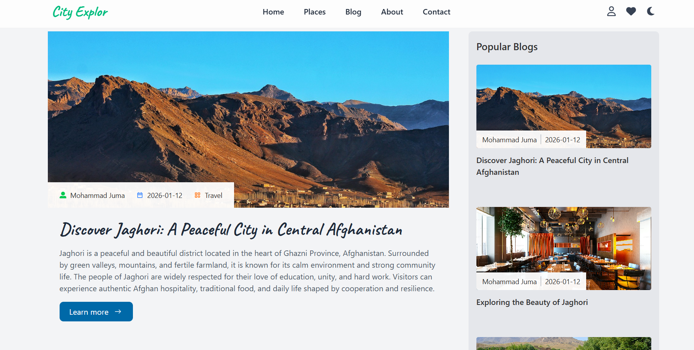
  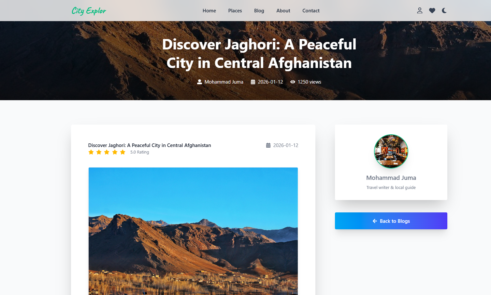

